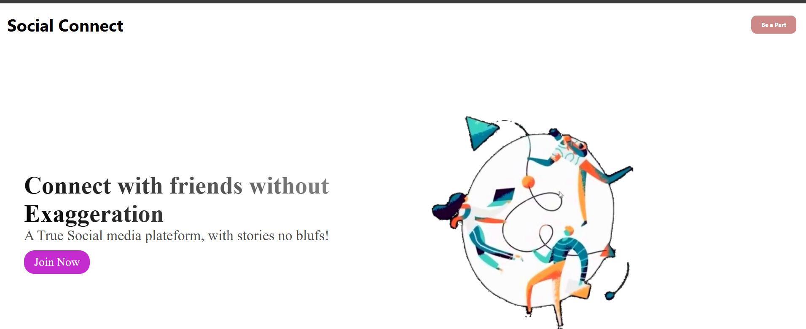
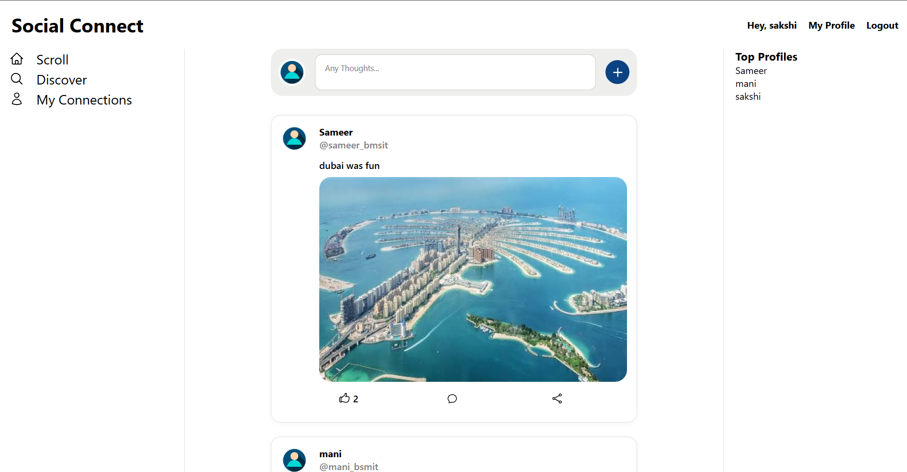

# SocialConnect – Connect Without Hesitation

A full-stack professional networking platform where users can create profiles, connect with others, share posts, and build their professional presence — built with the MERN-adjacent stack (MongoDB, Express.js, React/Next.js, Node.js).

🔗 **Live Demo:** [social-connect-connect-without-hesi.vercel.app](https://social-connect-connect-without-hesi.vercel.app/)

---

## Overview

SocialConnect is a professional networking platform I built to practice designing and shipping a full-stack app end-to-end — from schema design and REST API structure to state management and deployment. It covers the core mechanics of a networking product: authenticated profiles, a social feed with engagement (likes/comments), a connection-request system, and on-demand PDF resume generation.

State is managed with Redux Toolkit rather than plain Context, since profile data, the feed, and connection status all need to stay in sync across different pages without prop-drilling or redundant API calls. The connection system models each request as a simple state machine — `pending → accepted` — so a user's relationship to any other profile is always a single lookup rather than something inferred from scattered data. Resume export is handled by generating the PDF on the backend with PDFKit at request time, keeping the resume in sync with whatever the user's profile currently says instead of relying on a stale, pre-rendered file.

---

## Features

- **User Authentication** — secure registration and login with bcrypt password hashing and JWT-based session management, with the token stored client-side and attached to requests via an Axios interceptor
- **Profile Management** — editable bio, current position, past work experience, and education history
- **Profile Picture Upload** — image uploads via Multer
- **Social Feed** — create posts (text + image), like posts, and browse a live feed of user activity
- **Comments & Replies** — comment on posts, reply to comments, and like individual comments
- **Connections** — send, accept, or reject connection requests with other users
- **Discover Profiles** — browse other users' profiles on the platform
- **Resume Export** — generate and download a PDF resume/profile summary on demand using PDFKit
- **Username-based Profile Lookup** — view any user's public profile via their username

---

## Tech Stack

**Frontend**
- [Next.js](https://nextjs.org/) 16 (Pages Router)
- [React](https://react.dev/) 19 (with React Compiler)
- [Redux Toolkit](https://redux-toolkit.js.org/) + React-Redux — global state management
- [Axios](https://axios-http.com/) — API requests
- CSS Modules — component-scoped styling

**Backend**
- [Node.js](https://nodejs.org/) + [Express.js](https://expressjs.com/) — REST API
- [MongoDB](https://www.mongodb.com/) + [Mongoose](https://mongoosejs.com/) — database and schema modeling
- [bcrypt](https://www.npmjs.com/package/bcrypt) — password hashing
- [Multer](https://www.npmjs.com/package/multer) — file/image upload handling
- [PDFKit](https://pdfkit.org/) — PDF resume generation
- [CORS](https://www.npmjs.com/package/cors) — cross-origin request handling
- [dotenv](https://www.npmjs.com/package/dotenv) — environment variable management

**Deployment**
- Frontend deployed on [Vercel](https://vercel.com/)
- Backend deployed on [Render](https://render.com/)
- Database hosted on [MongoDB Atlas](https://www.mongodb.com/atlas)

---

## Project Structure

\`\`\`
project/
├── backend/
│   ├── controllers/       # Route logic (users, posts, comments, connections)
│   ├── models/            # Mongoose schemas
│   ├── routes/            # Express route definitions
│   ├── uploads/            # Uploaded media (dev only)
│   ├── server.js           # App entry point
│   └── .env                # Environment variables (not committed)
│
└── frontend/
    ├── src/
    │   ├── Components/     # Reusable UI components (Navbar, etc.)
    │   ├── config/          # App configuration
    │   ├── layout/          # Layout components
    │   ├── pages/            # Next.js pages (routes)
    │   └── styles/           # Global and module styles
    ├── public/               # Static assets
    └── next.config.mjs
\`\`\`

---

## API Endpoints

**User & Auth routes** (from `user.routes.js`)

Routes below are mounted under this router's base path (e.g. `/api/users`) — check `server.js`/`app.js` for the exact prefix used with `app.use()`.

| Method | Endpoint | Description |
|--------|----------|-------------|
| POST | `/register` | Register a new user |
| POST | `/login` | Log in and receive a session token |
| POST | `/update_profile_picture` | Upload/update profile picture (via Multer + Cloudinary) |
| POST | `/user_update` | Update core user fields |
| POST | `/update_profile_data` | Update profile data (bio, experience, education) |
| GET | `/get_user_and_profile` | Get the logged-in user's user + profile data |
| GET | `/get_all_profiles` | Get all user profiles (Discover) |
| GET | `/get_profile_based_on_username` | Get a user's profile by username |
| POST | `/send_connection_request` | Send a connection request |
| POST | `/accept_connection_request` | Accept a connection request |
| GET | `/user_connection_request` | Get the current user's connections |
| GET | `/get_my_connections_requests` | Get incoming connection requests |
| GET | `/download_resume` | Generate and download PDF resume |

---

## Getting Started (Local Setup)

### Prerequisites
- Node.js (v18+ recommended)
- A MongoDB database (local instance or a free [MongoDB Atlas](https://www.mongodb.com/atlas) cluster)

### 1. Clone the repository
\`\`\`bash
git clone https://github.com/Greek101God/SocialConnect---Connect-without-Hesitation.git
cd SocialConnect---Connect-without-Hesitation
\`\`\`

### 2. Backend Setup
\`\`\`bash
cd backend
npm install
\`\`\`

Create a `.env` file inside `backend/` with:
\`\`\`env
MONGO_URI=mongodb+srv://<username>:<password>@socialconnect.tcsedpp.mongodb.net/connectsocially?appName=socialconnect
PORT=9090
\`\`\`

Run the backend in development mode:
\`\`\`bash
npm run dev
\`\`\`

### 3. Frontend Setup
\`\`\`bash
cd ../frontend
npm install
npm run dev
\`\`\`

The frontend will run on `http://localhost:3000` and the backend on `http://localhost:9090` by default.

---

## Technical Highlights & What I Learned

- **Connection request state machine** — modeled each connection as `pending → accepted` rather than a boolean, so the UI can show the correct action ("Connect", "Pending", "Message") for any pair of users from a single field instead of extra queries.
- **PDF generation** — used PDFKit to stream-generate resumes on the backend at request time rather than pre-rendering and storing a file, so the export always reflects the user's latest profile data and no stale PDFs pile up in storage.
- **State management** — chose Redux Toolkit over Context so post likes, comments, and connection status update predictably across the feed and profile views without re-fetching or prop-drilling between components.
- **Auth security** — hashed passwords with bcrypt before storage and kept the JWT verification in Express middleware, so protected routes reject unauthenticated requests before any controller logic runs.
- **Deployment split** — running the frontend on Vercel and the backend on Render meant configuring CORS explicitly for the production frontend origin, and keeping `MONGO_URI` and other secrets in each platform's own environment variable settings rather than a shared `.env`.

---

## Author

**Sameer Jain**
[LinkedIn](https://linkedin.com/in/sameer-jain-714b37392) · [GitHub](https://github.com/Greek101God) · [LeetCode](https://leetcode.com/u/Greek_User)
